# GKE Enterprise Builder (Terragrunt)


A production-grade **Google Kubernetes Engine (GKE)** infrastructure builder using **Terraform** and **Terragrunt** for multi-environment deployments with enterprise security features including **Workload Identity** and private cluster configurations.

## 🏗️ Project Architecture

```mermaid
graph TB
    subgraph "Configuration Layer"
        ROOT[root.hcl<br/>Provider & Backend]
        ENV_DEV[env.hcl<br/>Dev Variables]
        ENV_PROD[env.hcl<br/>Prod Variables]
    end

    subgraph "Environments"
        DEV[🔧 dev]
        PROD[🚀 prod]
    end

    subgraph "Modules"
        VPC[📡 VPC Module]
        IAM_BASE[🔐 IAM-Base Module]
        IAM_WI[🆔 IAM-Workload Module]
        GKE[☸️ GKE Module]
    end

    ENV_DEV --> DEV
    ENV_PROD --> PROD
    ROOT --> DEV
    ROOT --> PROD

    DEV --> VPC
    DEV --> IAM_BASE
    DEV --> GKE
    DEV --> IAM_WI

    PROD --> VPC
    PROD --> IAM_BASE
    PROD --> GKE
    PROD --> IAM_WI

    VPC --> GKE
    IAM_BASE --> GKE
    GKE --> IAM_WI
```



## 📁 Directory Structure

```
gke-enterprise-builder/
├── live/                              # Environment configurations
│   ├── root.hcl                       # Root configuration (provider & backend)
│   ├── dev/                           # Development environment
│   │   ├── env.hcl                    # Environment-specific variables
│   │   ├── vpc/terragrunt.hcl
│   │   ├── iam-base/terragrunt.hcl    # GKE node service account
│   │   ├── gke/terragrunt.hcl
│   │   └── iam-workload/terragrunt.hcl # Workload Identity binding
│   └── prod/                          # Production environment
│       ├── env.hcl                    # Environment-specific variables
│       ├── vpc/terragrunt.hcl
│       ├── iam-base/terragrunt.hcl    # GKE node service account
│       ├── gke/terragrunt.hcl
│       └── iam-workload/terragrunt.hcl # Workload Identity binding
├── modules/                           # Reusable Terraform modules
│   ├── vpc/                           # VPC networking module
│   ├── iam-base/                      # GKE nodes service account
│   ├── iam-workload/                  # Workload Identity bindings
│   └── gke/                           # GKE cluster module
└── k8s/                               # Kubernetes manifests
    └── auth/
        └── workload-identity-sa.yaml  # KSA with Workload Identity
```

## 📦 Modules

### VPC Module

Creates the networking infrastructure for GKE:

| Resource                               | Description                           |
| -------------------------------------- | ------------------------------------- |
| `google_compute_network`               | VPC network (no auto-subnets)         |
| `google_compute_subnetwork`            | Subnetwork with secondary IP ranges   |
| `google_compute_router`                | Cloud Router for NAT                  |
| `google_compute_router_nat`            | NAT gateway for private nodes         |
| `google_compute_global_address`        | Private IP allocation for VPC peering |
| `google_service_networking_connection` | Private services access               |

---

### IAM-Base Module

Manages GKE node service accounts with minimal permissions:

| Resource                    | Description                                        |
| --------------------------- | -------------------------------------------------- |
| `google_service_account`    | GKE node service account                           |
| `google_project_iam_member` | IAM roles (logging, monitoring, artifact registry) |

**Assigned Roles:**

- `roles/logging.logWriter`
- `roles/monitoring.metricWriter`
- `roles/monitoring.viewer`
- `roles/stackdriver.resourceMetadata.writer`

---

### IAM-Workload Module

Implements **GKE Workload Identity** for secure pod-to-GCP authentication:

| Resource                            | Description                              |
| ----------------------------------- | ---------------------------------------- |
| `google_service_account`            | Application Google Service Account (GSA) |
| `google_service_account_iam_member` | Workload Identity binding (GSA ↔ KSA)    |

---

### GKE Module

Provisions private GKE clusters with Workload Identity:

| Resource                     | Description                                |
| ---------------------------- | ------------------------------------------ |
| `google_container_cluster`   | Private GKE cluster with Workload Identity |
| `google_container_node_pool` | Node pool with dedicated service account   |

**Key Features:**

- VPC-native networking mode
- Private nodes with Cloud NAT
- Workload Identity enabled
- Configurable master CIDR block

## 🔄 Module Dependencies


## 🌍 Environments

| Environment | Location       | Node Count | VPC CIDR      | Master CIDR   |
| ----------- | -------------- | ---------- | ------------- | ------------- |
| **dev**     | europe-west3-a | 3          | 10.0.0.0/16   | 172.16.0.0/28 |
| **prod**    | europe-west3-a | 3          | 172.17.0.0/16 | 172.20.0.0/28 |

## 📋 Environment Variables (`env.hcl`)

Each environment has an `env.hcl` file that centralizes all environment-specific configuration, **eliminating hardcoded values**.

### Structure

```hcl
# live/{env}/env.hcl
locals {
  project_id             = "your-gcp-project-id"
  region                 = "europe-west3"
  location               = "${local.region}-a"
  bucket_name            = "your-terraform-state-bucket"
  env_name               = "dev"  # or "prod"
  master_ipv4_cidr_block = "172.16.0.0/28"
  ip_cidr_range          = "10.0.0.0/16"
  pod_cidr_range         = "10.10.0.0/16"
  service_cidr_range     = "10.20.0.0/20"
  node_count             = 3
  # Workload Identity
  gsa_name               = "my-app-server"
  ksa_name               = "app-service-account"
  namespace              = "development"
}
```

### Variable Reference

| Variable                 | Description                      | Example               |
| ------------------------ | -------------------------------- | --------------------- |
| `project_id`             | GCP Project ID                   | `learn-2612`          |
| `region`                 | GCP region for resources         | `europe-west3`        |
| `location`               | Zone for zonal resources         | `europe-west3-a`      |
| `env_name`               | Environment identifier           | `dev`, `prod`         |
| `bucket_name`            | GCS bucket for Terraform state   | `my-tf-state-bucket`  |
| `master_ipv4_cidr_block` | CIDR for GKE control plane       | `172.16.0.0/28`       |
| `ip_cidr_range`          | Primary CIDR for VPC subnet      | `10.0.0.0/16`         |
| `pod_cidr_range`         | Secondary CIDR for GKE pods      | `10.10.0.0/16`        |
| `service_cidr_range`     | Secondary CIDR for GKE services  | `10.20.0.0/20`        |
| `node_count`             | Number of nodes in GKE node pool | `3`                   |
| `gsa_name`               | Google Service Account name      | `my-app-server`       |
| `ksa_name`               | Kubernetes Service Account name  | `app-service-account` |
| `namespace`              | Kubernetes namespace for KSA     | `development`         |

## 🌐 Network CIDR Planning

### Understanding CIDR Ranges

This project uses **separate CIDR ranges** for different network components to avoid IP conflicts:


### Master IPv4 CIDR Block

> [!IMPORTANT]
> The `master_ipv4_cidr_block` defines the IP range for the GKE control plane (master nodes). This CIDR **must not overlap** with any other network ranges in your infrastructure including:
>
> - VPC primary CIDR (`ip_cidr_range`)
> - Pod secondary CIDR (`pod_cidr_range`)
> - Service secondary CIDR (`service_cidr_range`)
> - Any peered VPCs or on-premises networks

**Best Practices:**

- Use a `/28` CIDR block (provides 16 IPs, only 5 needed for master)
- Choose a range from RFC 1918 private space that doesn't conflict with node ranges
- Keep master CIDRs consistent across environments for easier network management

| Environment | Master CIDR     | Purpose                         |
| ----------- | --------------- | ------------------------------- |
| dev         | `172.16.0.0/28` | Isolated control plane for dev  |
| prod        | `172.20.0.0/28` | Isolated control plane for prod |

## 🆔 Workload Identity

This project implements **GKE Workload Identity** for secure, keyless authentication between Kubernetes pods and Google Cloud APIs.

### How It Works


### Configuration

**1. GKE Cluster** enables Workload Identity pool:

```hcl
workload_identity_config {
  workload_pool = "${var.project_id}.svc.id.goog"
}
```

**2. IAM-Workload Module** creates the GSA-KSA binding:

```hcl
resource "google_service_account_iam_member" "workload_identity_binding" {
  role   = "roles/iam.workloadIdentityUser"
  member = "serviceAccount:${project}.svc.id.goog[${namespace}/${ksa_name}]"
}
```

**3. Kubernetes ServiceAccount** with annotation:

```yaml
apiVersion: v1
kind: ServiceAccount
metadata:
  name: app-service-account
  namespace: development
  annotations:
    iam.gke.io/gcp-service-account: my-app-server@PROJECT.iam.gserviceaccount.com
```

### Verifying Workload Identity

```bash
kubectl run workload-test --rm -it \
  --namespace development \
  --image google/cloud-sdk:slim \
  --overrides='{"spec":{"serviceAccountName":"app-service-account"}}' \
  -- gcloud auth list
```

Expected output:

```
ACTIVE  ACCOUNT
*       my-app-server@PROJECT.iam.gserviceaccount.com
```

## 🔒 Security Features

| Feature                          | Description                            |
| -------------------------------- | -------------------------------------- |
| ✅ **Private GKE Nodes**         | Nodes don't have public IPs            |
| ✅ **NAT Gateway**               | Outbound internet access via Cloud NAT |
| ✅ **Workload Identity**         | Keyless authentication for pods        |
| ✅ **Dedicated Service Account** | Least-privilege IAM for GKE nodes      |
| ✅ **VPC-Native Networking**     | Alias IP ranges for pods/services      |
| ✅ **Private VPC Peering**       | Secure Google services access          |
| ✅ **Configurable Master CIDR**  | Isolated control plane network         |
| ✅ **Environment Isolation**     | Separate CIDR ranges per environment   |

## ⚙️ Configuration

### Backend Configuration

- **Backend**: Google Cloud Storage (GCS)
- **State Path**: `{environment}/{module}/terraform.tfstate`

> [!WARNING]
> **Consider enabling Object Versioning on the state bucket.** Without versioning, if the state file is accidentally deleted or corrupted, you will lose the ability to manage your infrastructure through Terraform. This means:
>
> - **Loss of cluster control** - Terraform won't know what resources exist
> - **Manual cleanup required** - You'll need to manually delete or import resources
> - **Potential orphaned resources** - Resources may continue running and incurring costs
>
> Enable versioning to allow state recovery: `gsutil versioning set on gs://BUCKET_NAME`

### Provider Configuration

- **Project**: Defined in `env.hcl` per environment
- **Region**: Configurable per environment

## 🚀 Usage

### Prerequisites

1. Install [Terraform](https://terraform.io/downloads.html) >= 1.0
2. Install [Terragrunt](https://terragrunt.gruntwork.io/docs/getting-started/install/) >= 0.88
3. Configure GCP authentication:
   ```bash
   gcloud auth application-default login
   ```
4. Ensure the GCS bucket exists for state storage

### Deploy All Modules

```bash
# Development
cd live/dev
terragrunt run --all apply

# Production
cd live/prod
terragrunt run --all apply
```

### Deploy Single Module

```bash
cd live/dev/gke
terragrunt run apply
```

### Plan Changes

```bash
cd live/dev
terragrunt run --all plan
```

## 🧹 Cleanup

> [!WARNING]
> Destroying infrastructure will permanently delete all resources including the GKE cluster and any workloads running on it. Make sure to backup any important data before proceeding.

### Destroy Single Environment

```bash
# Development
cd live/dev
terragrunt run --all destroy

# Production
cd live/prod
terragrunt run --all destroy
```

### Destroy Single Module

```bash
cd live/dev/gke
terragrunt run destroy
```

### Destroy Order

Terragrunt handles dependencies automatically, but if you need to destroy manually, follow this order:

1. `iam-workload` (depends on GKE)
2. `gke` (depends on VPC and IAM-Base)
3. `iam-base`
4. `vpc`

## 🔧 Troubleshooting

### Common Issues

#### 409 Conflict: Resource Already Exists

**Error:**

```
Error: Error creating ServiceAccount: googleapi: Error 409: Service account already exists
```

**Cause:** The resource was created outside of Terraform or exists from a previous failed deployment.

**Solution:** Import the existing resource into Terraform state:

```bash
# Import service account
cd live/dev/iam-base
terragrunt run -- import google_service_account.gke_nodes projects/PROJECT_ID/serviceAccounts/ACCOUNT_ID@PROJECT_ID.iam.gserviceaccount.com

# Import GKE cluster
cd live/dev/gke
terragrunt run -- import google_container_cluster.primary projects/PROJECT_ID/locations/LOCATION/clusters/CLUSTER_NAME
```

---

#### VPC/Subnet CIDR Conflicts

**Error:**

```
Error: Error creating Subnetwork: googleapi: Error 409: The resource already exists
```

**Cause:** CIDR range overlaps with an existing subnet or the subnet name is already in use.

**Solution:**

1. Check existing subnets: `gcloud compute networks subnets list`
2. Either delete the conflicting subnet or choose a different CIDR range in `env.hcl`
3. Ensure `master_ipv4_cidr_block` doesn't overlap with node CIDR ranges

---

#### Workload Identity Not Working

**Symptoms:** Pod cannot authenticate to GCP APIs.

**Checklist:**

1. Verify GKE cluster has Workload Identity enabled:
   ```bash
   gcloud container clusters describe CLUSTER_NAME --zone ZONE --format="value(workloadIdentityConfig.workloadPool)"
   ```
2. Verify the KSA annotation is correct:
   ```bash
   kubectl get serviceaccount KSA_NAME -n NAMESPACE -o yaml
   ```
3. Verify the IAM binding exists:
   ```bash
   gcloud iam service-accounts get-iam-policy GSA_EMAIL
   ```

## 📊 Infrastructure Flow


## 📝 License

This project is provided as-is for infrastructure as code learning and development purposes.
